# Compact Photodiode  
Designed by Olgierd Matusiewicz

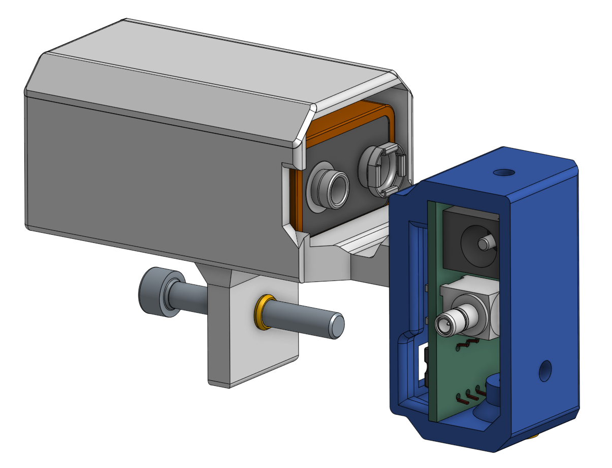

## Table of Contents
1. [About](#introduction)
2. [Specs](#specifications)
3. [Assembly Guide](#assembly-guide)

## About 
This project was created to provide a compact photodiode capable of detecting monitor brightness with precision and speed. It is powered by a 9V battery to avoid the clutter of a power cable, though a standard barrel plug allows for optional wired power. To maintain its compact form, it uses an SMB connector.

### Timeline / History
Full history can be read in the document [here](https://docs.google.com/document/d/1O3Zm9NQxsYEWKotZ27IH0cOTP2e1casB0-onith1tGs/edit?tab=t.0), but the abridged version is this:
1. Started out with the idea to develop the entirety of the circuit, including the TIA (Transimpendance Amplifier), however that required many small parts and had many possible points of failure, so was abandoned in favor of an all-in-one solution in the form of the [OPT101P](https://www.ti.com/lit/ds/symlink/opt101.pdf)
2. Upon getting the circuit and assembling it, it was giving readings with much less gain than expected. This was the result of not giving it enough voltage, as I did not know that by default the Analog Discovery 3 I was using (osciloscope) provides ~600mV instead of 5V to its V+
3. Afterwards, testing was done on an LED and then monitor to try to determinte the photodiode's (OPT101P's) impulse function to ensure we understood its behavior
4. Minaturization in the form of ordering a PCB and making the case as well as the battery holder
5. The photodiode was giving not enough gain while having a responsivity higher than needed, so instead of the default 1M resistor that comes built-in I swapped it for an external 2M resistor, and that had a good balance
6. Case was updated to make it easier to print as well as to include heat inserts for better assembly / disassembly

## Specifications 

### Parts 
- Custom-designed PCB ([CAD](https://github.com/Dungewar/KiCad-projects))
- 3D-printed case ([CAD](https://cad.onshape.com/documents/6f7ee8db8fefbd2cf8f54ffc/w/caae3841e57d43808c4b1e5b/e/8d809ec34b83ba82dc67b49b))
- Battery components (if using a battery):
    - 3D-printed battery holder  
    - 9V battery  
    - [Battery connector](https://www.digikey.com/en/products/detail/dfrobot/FIT0043/7597082?gQT=1)
- [SMB connector](https://www.digikey.com/en/products/detail/molex/0731000103/1465145)
- [Power barrel plug](https://www.digikey.com/en/products/detail/same-sky-formerly-cui-devices/PJ-102AH/408448)
- [Photodiode (OPT101P)](https://www.digikey.pl/pl/products/detail/texas-instruments/OPT101P/251177)
- [Feedback resistor (5MΩ)](https://www.digikey.com/en/products/detail/stackpole-electronics-inc/CF14JT5M10/1741449)
- [Optional capacitor (0.5pF)](https://www.digikey.com/en/products/detail/murata-electronics/GCM1885C2AR50BA16D/16033780)

### Power Supply
The OPT101P photodiode requires a minimum of 2.7V. Higher input voltages increase gain, up to a maximum of 36V. A 9V battery is more than sufficient to ensure strong signal detection.

### Responsivity
Although the OPT101P includes a built-in 1MΩ feedback resistor, it did not provide adequate gain for this application. Since gain is directly proportional to resistance and inversely proportional to bandwidth, a 5MΩ resistor was selected to improve monitor detection performance while maintaining reasonable speed.

For usage on the monitor, the photodiode is better at detecting the same brightness change at higher base brighness, as per graph below.

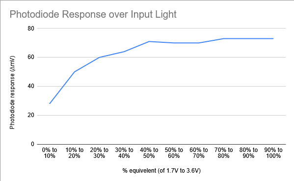

Graph shows how much the photodiode responds for a flickering monitor light that switches from 0% to 10%, 10% to 20%, etc. within 16ms (every frame). Taken from [Photodiode LED Testing](https://docs.google.com/spreadsheets/d/1R1jh_Y6DrDVoqCM2nb0XCUPiysDj50N7ofd7CoB2yAs/edit?gid=680766239#gid=680766239).

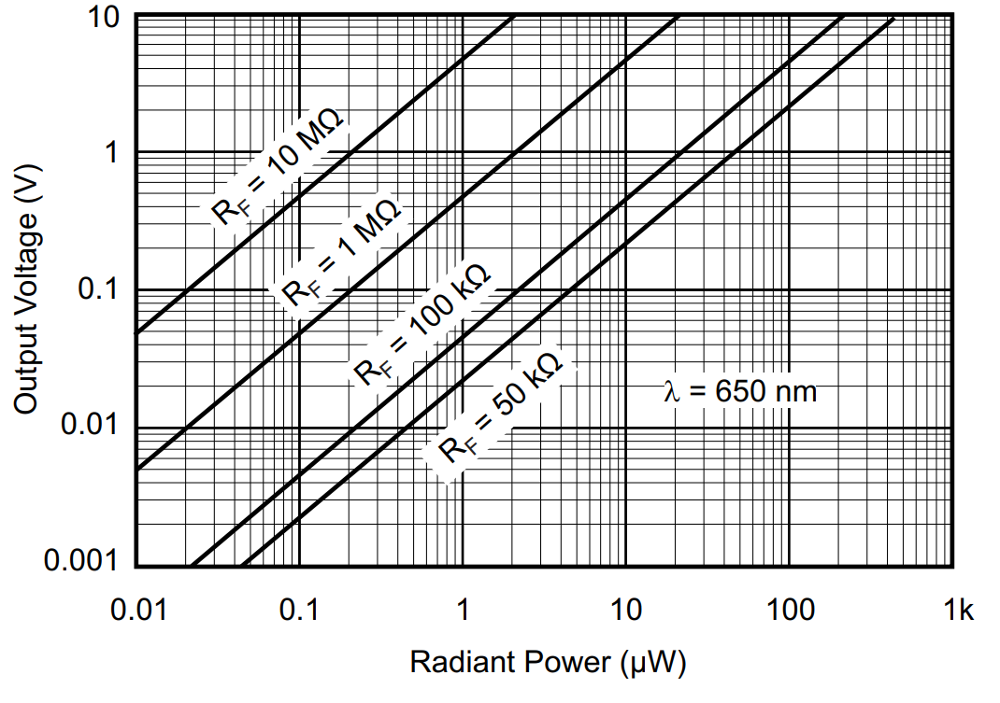

Taken from [OPT101P specifications](https://www.ti.com/lit/ds/symlink/opt101.pdf?HQS=dis-dk-null-digikeymode-dsf-pf-null-wwe&ts=1751809082858&ref_url=https%253A%252F%252Fwww.ti.com%252Fgeneral%252Fdocs%252Fsuppproductinfo.tsp%253FdistId%253D10%2526gotoUrl%253Dhttps%253A%252F%252Fwww.ti.com%252Flit%252Fgpn%252Fopt101)

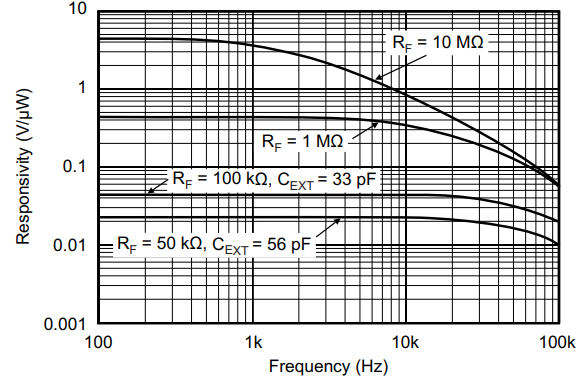

Taken from [OPT101P specifications](https://www.ti.com/lit/ds/symlink/opt101.pdf?HQS=dis-dk-null-digikeymode-dsf-pf-null-wwe&ts=1751809082858&ref_url=https%253A%252F%252Fwww.ti.com%252Fgeneral%252Fdocs%252Fsuppproductinfo.tsp%253FdistId%253D10%2526gotoUrl%253Dhttps%253A%252F%252Fwww.ti.com%252Flit%252Fgpn%252Fopt101)

## Assembly Guide 

1. Gather all components:
    - [PCB CAD model](https://github.com/Dungewar/KiCad-projects)
    - [Case CAD model](https://cad.onshape.com/documents/6f7ee8db8fefbd2cf8f54ffc/w/caae3841e57d43808c4b1e5b/e/8d809ec34b83ba82dc67b49b)
    - Other components available via DigiKey, listed in [Specifications](#parts)

2. Solder the components onto the PCB  
    - Refer to the CAD model for guidance. However, the PCB itself is labeled and outlined clearly enough for straightforward assembly.

3. Apply superglue along the inner rim of the 3D-printed case  
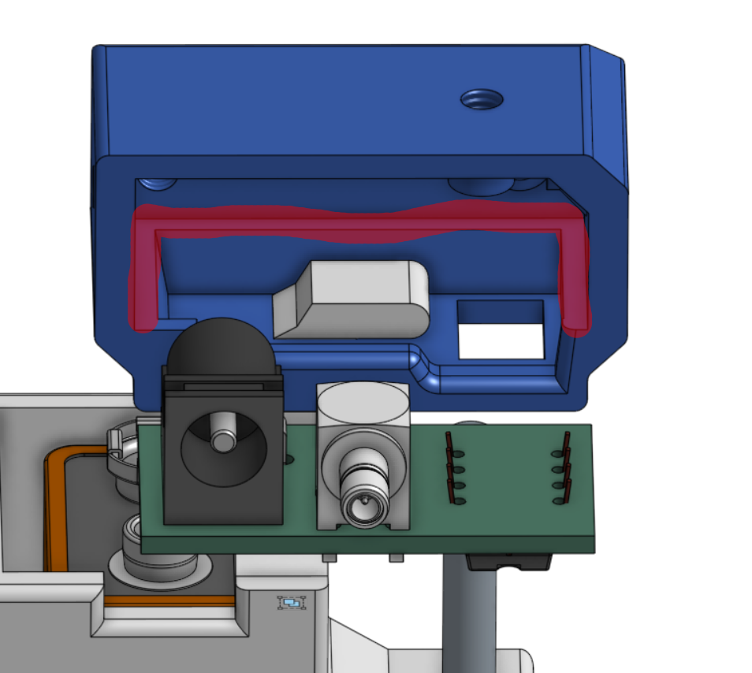

4. Insert the PCB into the case and gently press down for about 20 seconds to secure the bond  
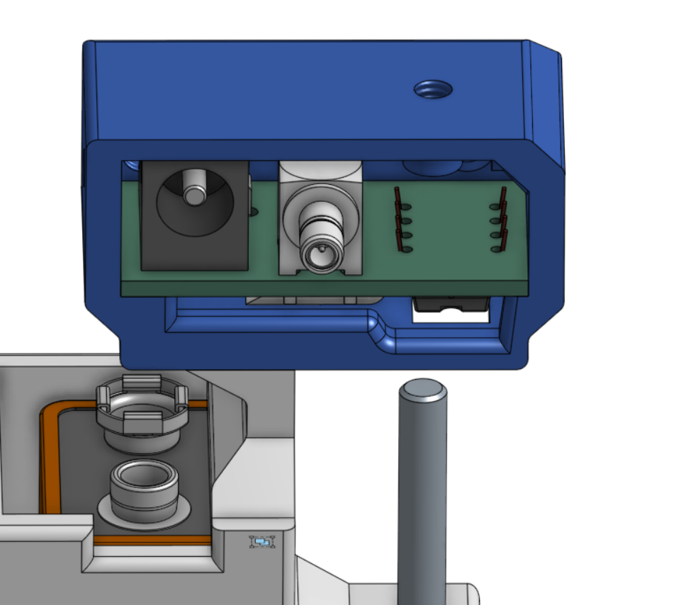

5. If using a battery, insert it as shown. Ensure the smaller terminal is positioned near the case notch.  
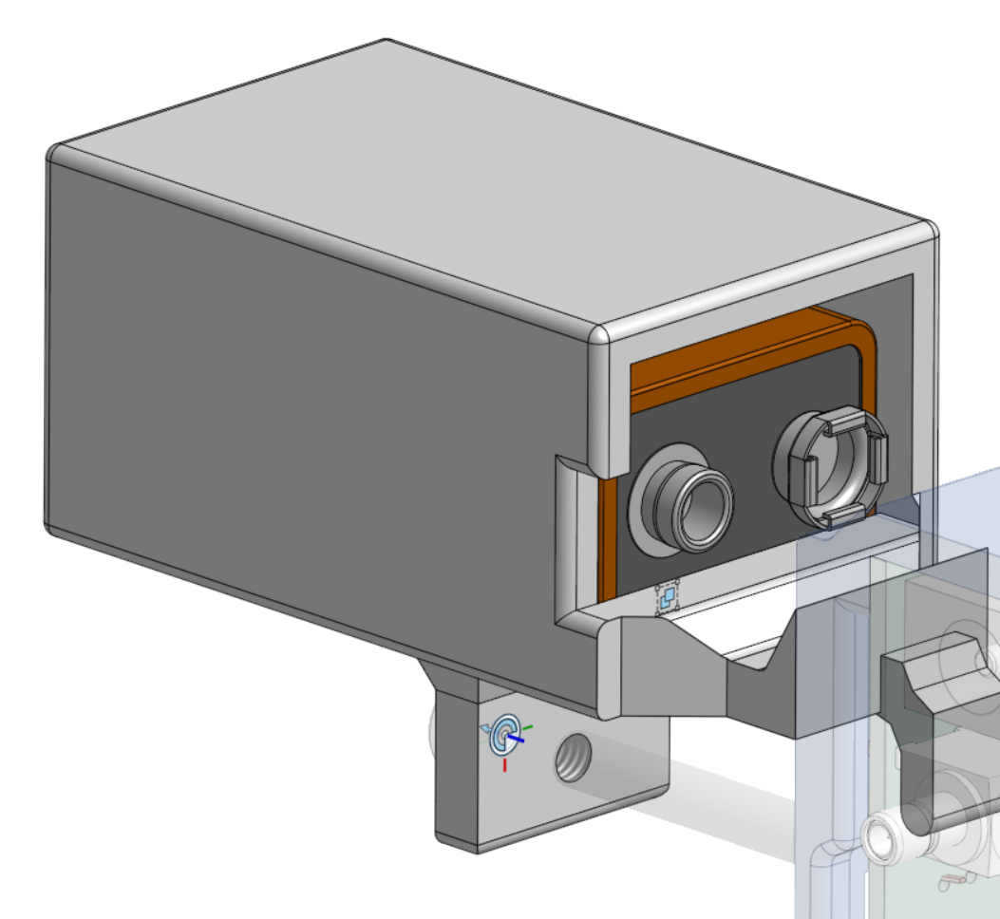

6. Connect the battery to the battery connector

7. Insert the battery holder into the PCB case as shown  
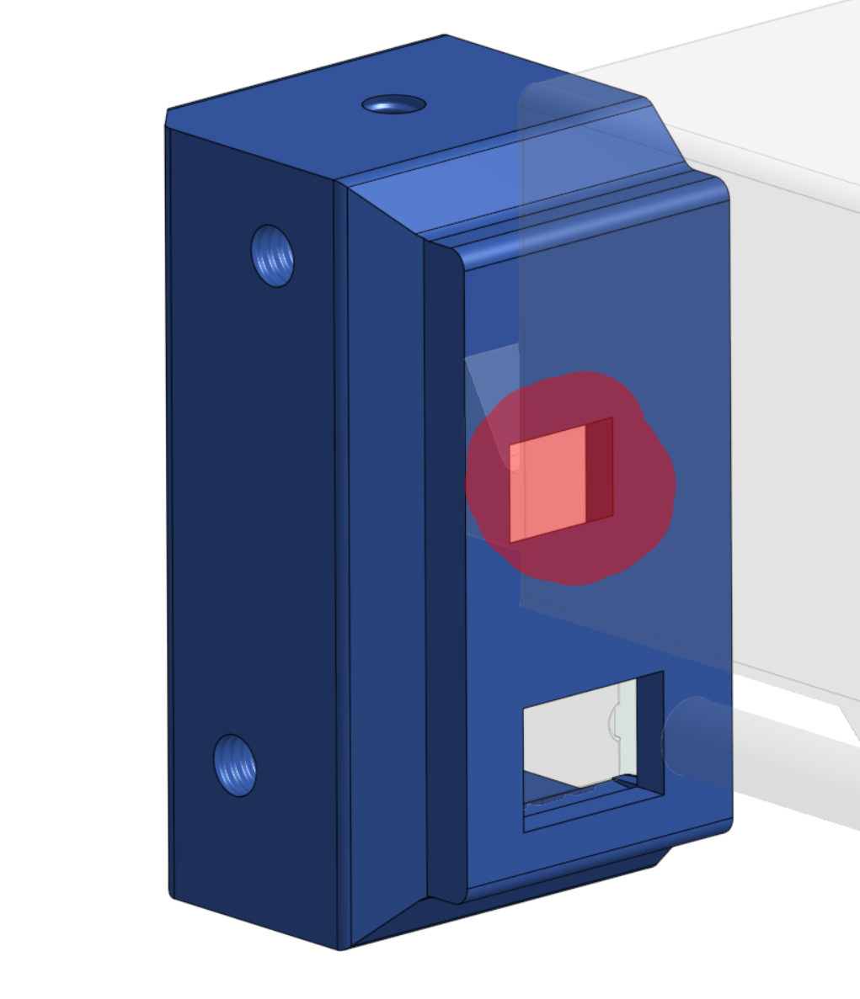  
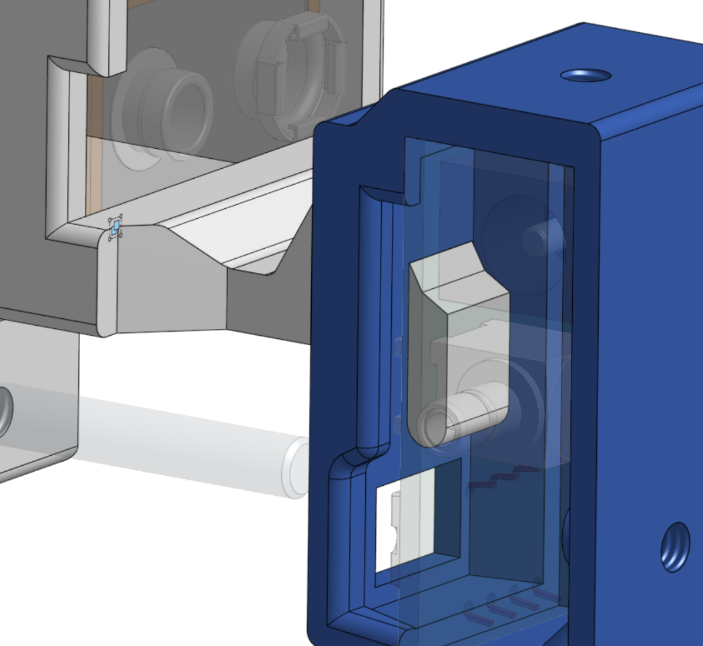  
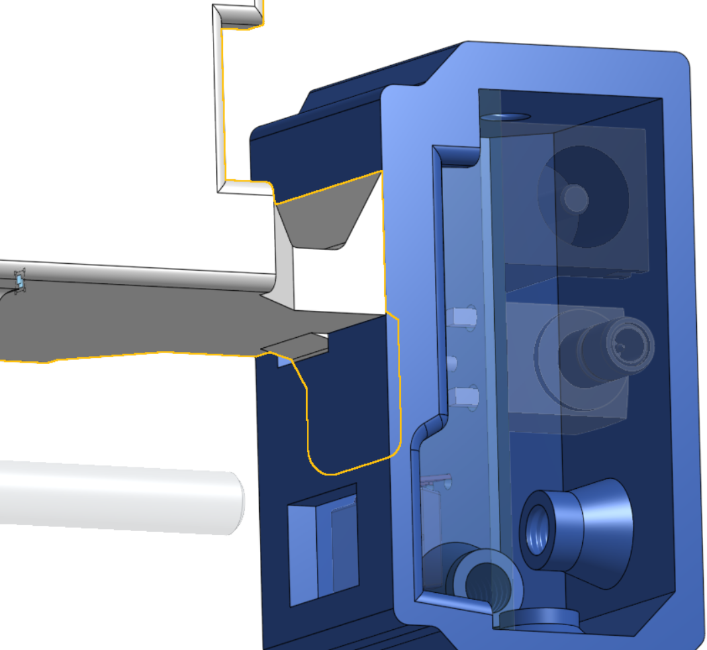

8. Plug the barrel connector into the barrel jack

9. To mount the device to a monitor, use the screw slot on the battery holder. Tighten a screw through it to secure the assembly to any monitor size.  
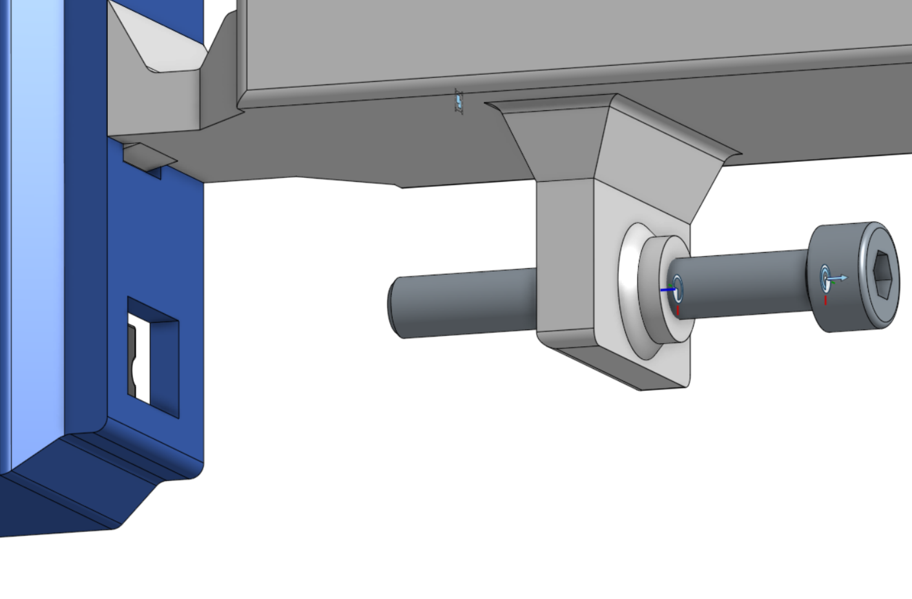

10. Assembly complete. To operate the device, connect it via the SMB port and begin reading the signal.
