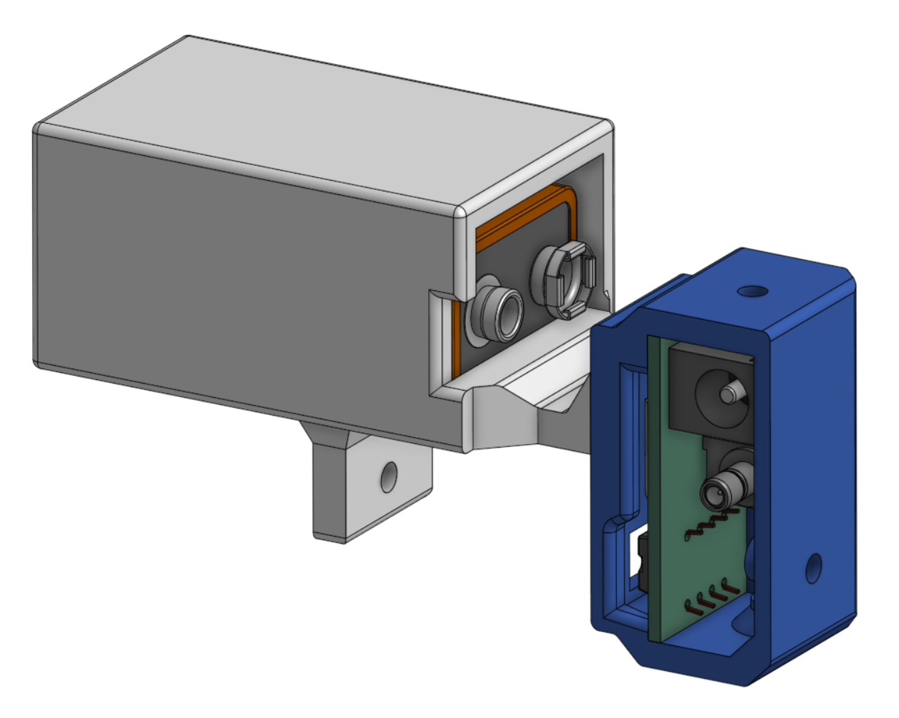

# Compact Photodiode  
Designed by Olgierd Matusiewicz

## Table of Contents
1. [About](#introduction)
2. [Specs](#specifications)
3. [Assembly Guide](#assembly-guide)

## About 
This project was created to provide a compact photodiode capable of detecting monitor brightness with precision and speed. It is powered by a 9V battery to avoid the clutter of a power cable, though a standard barrel plug allows for optional wired power. To maintain its compact form, it uses an SMB connector.

## Specifications 

### Parts 
- Custom-designed PCB
- 3D-printed case
- Battery components (if using a battery):
    - 3D-printed battery holder  
    - 9V battery  
    - [Battery connector](https://www.digikey.com/en/products/detail/dfrobot/FIT0043/7597082?gQT=1)
- [SMB connector](https://www.digikey.com/en/products/detail/molex/0731000103/1465145)
- [Power barrel plug](https://www.digikey.com/en/products/detail/same-sky-formerly-cui-devices/PJ-102AH/408448)
- [Photodiode (OPT101P)](https://www.digikey.pl/pl/products/detail/texas-instruments/OPT101P/251177)
- [Feedback resistor (5MΩ)](https://www.digikey.com/en/products/detail/stackpole-electronics-inc/CF14JT5M10/1741449)
- [Optional capacitor (0.5pF)](https://www.digikey.com/en/products/detail/murata-electronics/GCM1885C2AR50BA16D/16033780)

### Power Supply
The OPT101P photodiode requires a minimum of 2.7V. Higher input voltages increase gain, up to a maximum of 36V. A 9V battery is more than sufficient to ensure strong signal detection.

### Responsivity
Although the OPT101P includes a built-in 1MΩ feedback resistor, it did not provide adequate gain for this application. Since gain is directly proportional to resistance and inversely proportional to bandwidth, a 5MΩ resistor was selected to improve monitor detection performance while maintaining reasonable speed.

Taken from [OPT101P specifications](https://www.ti.com/lit/ds/symlink/opt101.pdf?HQS=dis-dk-null-digikeymode-dsf-pf-null-wwe&ts=1751809082858&ref_url=https%253A%252F%252Fwww.ti.com%252Fgeneral%252Fdocs%252Fsuppproductinfo.tsp%253FdistId%253D10%2526gotoUrl%253Dhttps%253A%252F%252Fwww.ti.com%252Flit%252Fgpn%252Fopt101)

Taken from [OPT101P specifications](https://www.ti.com/lit/ds/symlink/opt101.pdf?HQS=dis-dk-null-digikeymode-dsf-pf-null-wwe&ts=1751809082858&ref_url=https%253A%252F%252Fwww.ti.com%252Fgeneral%252Fdocs%252Fsuppproductinfo.tsp%253FdistId%253D10%2526gotoUrl%253Dhttps%253A%252F%252Fwww.ti.com%252Flit%252Fgpn%252Fopt101)

## Assembly Guide 

1. Gather all components:
    - [PCB CAD model](https://github.com/Dungewar/KiCad-projects)
    - [Case CAD model](https://cad.onshape.com/documents/6f7ee8db8fefbd2cf8f54ffc/w/caae3841e57d43808c4b1e5b/e/8d809ec34b83ba82dc67b49b)
    - Other components available via DigiKey, listed in [Specifications](#parts)

2. Solder the components onto the PCB  
    - Refer to the CAD model for guidance. However, the PCB itself is labeled and outlined clearly enough for straightforward assembly.

3. Apply superglue along the inner rim of the 3D-printed case  

4. Insert the PCB into the case and gently press down for about 20 seconds to secure the bond  

5. If using a battery, insert it as shown. Ensure the smaller terminal is positioned near the case notch.  

6. Connect the battery to the battery connector

7. Insert the battery holder into the PCB case as shown  
  
  

8. Plug the barrel connector into the barrel jack

9. To mount the device to a monitor, use the screw slot on the battery holder. Tighten a screw through it to secure the assembly to any monitor size.  

10. Assembly complete. To operate the device, connect it via the SMB port and begin reading the signal.
